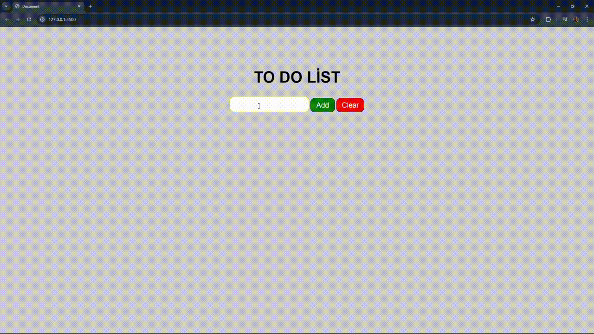

<h4>To Do List <h4>

This project is a simple web application that performs basic CRUD (Create, Read, Update, Delete) functions. This application allows users to create, read, update and delete data. Designed with HTML, CSS and JavaScript.

Features

-Creating Data: Ability to add new data.

-Data Read: Listing available data.

-Data Update: Ability to update existing data.

-Data Deletion (Delete): Ability to delete existing data.

Screen

